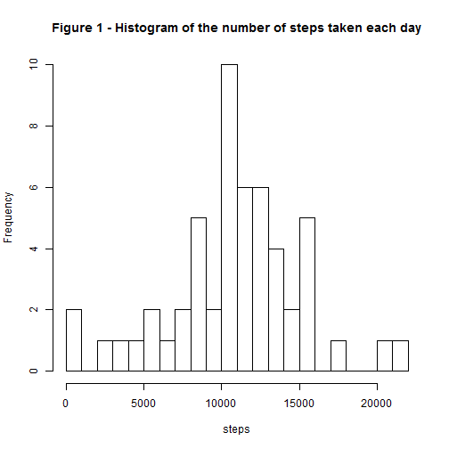
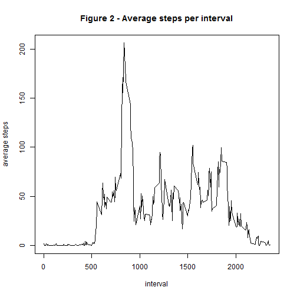
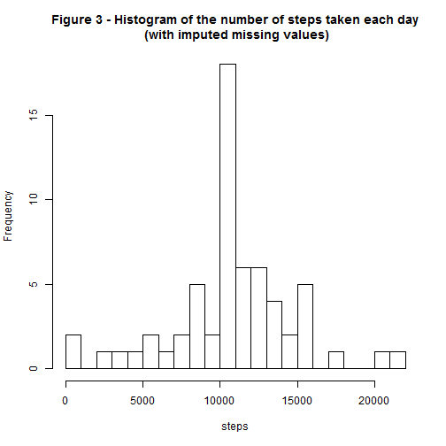
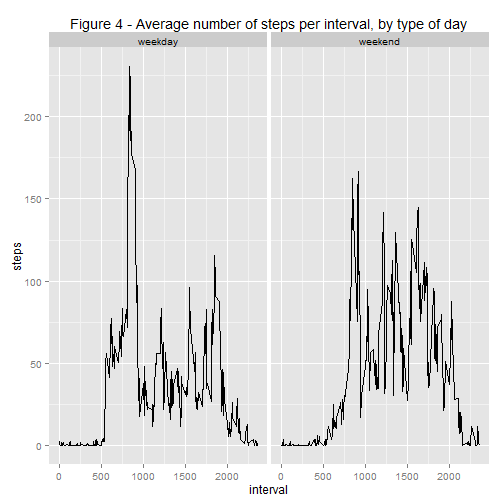

### Loading the data
The code to unzip the file, in case it hasn't been done before, is included. Then to read the data a call to the read.csv() function is enough.
No particular processing on the downloaded data has been done at this stage of the analisys.


```r
if (!file.exists("activity.csv"))
{
    unzip(zipfile = "activity.zip")
}
dataset <- read.csv("activity.csv")
```

The first lines of the dataset show that the process of reading the data was correct and the dataset contains three variables: "steps" (with some NA values), "date" and "interval".


```r
head(dataset,10)
```

```
##    steps       date interval
## 1     NA 2012-10-01        0
## 2     NA 2012-10-01        5
## 3     NA 2012-10-01       10
## 4     NA 2012-10-01       15
## 5     NA 2012-10-01       20
## 6     NA 2012-10-01       25
## 7     NA 2012-10-01       30
## 8     NA 2012-10-01       35
## 9     NA 2012-10-01       40
## 10    NA 2012-10-01       45
```

### What is the mean of the total number of steps taken per day?
#### 1. Calculate the total number of steps taken per day
To answer this question we create another dataset with the aggregate() and the sum() functions, so that for each day the total number of steps is computed. Note that since the value of the 'na.action' argument was set to NULL, even the days with NAs as the number of steps are returned.

```r
total.steps.day <- aggregate(data = dataset, steps ~ date, FUN = sum, na.action = NULL)
head(total.steps.day, 15)
```

```
##          date steps
## 1  2012-10-01    NA
## 2  2012-10-02   126
## 3  2012-10-03 11352
## 4  2012-10-04 12116
## 5  2012-10-05 13294
## 6  2012-10-06 15420
## 7  2012-10-07 11015
## 8  2012-10-08    NA
## 9  2012-10-09 12811
## 10 2012-10-10  9900
## 11 2012-10-11 10304
## 12 2012-10-12 17382
## 13 2012-10-13 12426
## 14 2012-10-14 15098
## 15 2012-10-15 10139
```
#### 2. Make a histogram of the total number of steps taken each day

```r
hist(x=total.steps.day$steps, xlab = "steps", breaks = 20, main = "Figure 1 - Histogram of the number of steps taken each day" )
```

 

#### 3. Calculate and report the mean and median of the total number of steps taken per day

```r
mean(total.steps.day$steps, na.rm=TRUE)
```

```
## [1] 10766.19
```

```r
median(total.steps.day$steps, na.rm=TRUE)
```

```
## [1] 10765
```

### What is the average daily activity pattern?
#### 1.Make a time series plot of the 5-minute interval (x-axis) and the average number of steps taken, averaged across all days (y-axis)
The plot shows that the central intervals are the ones with most of the steps activity, in average, while the intervals at the beginning and the end of the day have a slower activity. There is a peak at about the 800th interval.

```r
average.steps.interval <- aggregate(data = dataset, steps ~ interval, FUN = mean, na.rm=TRUE)
plot(x=average.steps.interval$interval, y=average.steps.interval$steps, type="l", xlab = "interval", ylab = "average steps", main = "Figure 2 - Average steps per interval")  
```

 

#### 2.Which 5-minute interval, on average across all the days in the dataset, contains the maximum number of steps?
To identify the interval with the maximum number of steps, we identify the greatest number in the steps column and then look for its index in the vector. It turns out that the interval with the greatest number of steps is the number 835 (with more than 200 steps), which confirms the findings made in Figure 2.

```r
index_max <- which(average.steps.interval$steps == max(average.steps.interval$steps))
average.steps.interval[index_max,]
```

```
##     interval    steps
## 104      835 206.1698
```


### Imputing missing values
#### 1. Calculate and report the total number of missing values in the dataset (i.e. the total number of rows with NAs)
The number of missing values in the original dataset is 2304.

```r
sum(is.na(dataset$steps))
```

```
## [1] 2304
```


#### 2.Devise a strategy for filling in all of the missing values in the dataset. The strategy does not need to be sophisticated. For example, you could use the mean/median for that day, or the mean for that 5-minute interval, etc.
I have chosen to replace the NA values with the mean values across days of the number of steps for each interval that has missing values. In order to do that the two datasets - the original one and the one which contains the average steps for each interval - are merged so that the original dataset has an additional column, containing the average steps.

```r
library(dplyr)
dataset2 = merge(x = dataset, y = average.steps.interval, by = "interval")
dataset2 = arrange(dataset2, date, interval)
names(dataset2) = c("interval", "steps", "date", "steps.mean")
head(dataset2, 10)
```

```
##    interval steps       date steps.mean
## 1         0    NA 2012-10-01  1.7169811
## 2         5    NA 2012-10-01  0.3396226
## 3        10    NA 2012-10-01  0.1320755
## 4        15    NA 2012-10-01  0.1509434
## 5        20    NA 2012-10-01  0.0754717
## 6        25    NA 2012-10-01  2.0943396
## 7        30    NA 2012-10-01  0.5283019
## 8        35    NA 2012-10-01  0.8679245
## 9        40    NA 2012-10-01  0.0000000
## 10       45    NA 2012-10-01  1.4716981
```
#### 3.Create a new dataset that is equal to the original dataset but with the missing data filled in.
Using a for cycle to imput the mean value of the steps where a NA value is; then to obtain a dataset equal to the original one is sufficient to exclude the last column.

```r
for(i in 1:length(dataset2$steps))
{
 if (is.na(dataset2$steps[i]) == TRUE)
 {
   dataset2$steps[i] = dataset2$steps.mean[i]
  }
}
dataset2 = dataset2[,1:3]
head(dataset2, 10)
```

```
##    interval     steps       date
## 1         0 1.7169811 2012-10-01
## 2         5 0.3396226 2012-10-01
## 3        10 0.1320755 2012-10-01
## 4        15 0.1509434 2012-10-01
## 5        20 0.0754717 2012-10-01
## 6        25 2.0943396 2012-10-01
## 7        30 0.5283019 2012-10-01
## 8        35 0.8679245 2012-10-01
## 9        40 0.0000000 2012-10-01
## 10       45 1.4716981 2012-10-01
```
#### 4.Make a histogram of the total number of steps taken each day and Calculate and report the mean and median total number of steps taken per day. Do these values differ from the estimates from the first part of the assignment? What is the impact of imputing missing data on the estimates of the total daily number of steps?
As it can be seen from the results below, using the number of steps across-days average for the intervals with missing values had no impact to the mean, which is equal to the one obtained from the original dataset. The median values, however, differ and in the new dataset the median has the same value of the mean.

```r
total.steps2 <- aggregate(data = dataset2, steps ~ date, FUN = sum)
hist(x=total.steps2$steps, xlab = "steps", breaks = 20, main = "Figure 3 - Histogram of the number of steps taken each day\n (with imputed missing values)")
```

 

```r
mean(total.steps2$steps)
```

```
## [1] 10766.19
```

```r
median(total.steps2$steps)
```

```
## [1] 10766.19
```

### Are there differences in activity patterns between weekdays and weekends?

#### 1.Create a new factor variable in the dataset with two levels - "weekday" and "weekend" indicating whether a given date is a weekday or weekend day.
The function Sys.setlocale() has been used to ensure that the names of the week days are set to English (it's necessary for the subsequent conditional statements). With a for cycle each date is checked for being a weekend day or not and then a corresponding string is added to a vector. This vector is then added to the dataset and converted to a factor.

```r
Sys.setlocale("LC_TIME", "English")
```

```r
dataset2$date<-as.Date(dataset2$date)   
weekdays = 0

for (i in 1:length(dataset2$date))
{
  if (weekdays(dataset2$date[i]) == "Saturday" | weekdays(dataset2$date[i]) == "Sunday")
  {
    weekdays[i] = "weekend"
  }
  else
  {
    weekdays[i] = "weekday"
    
  }
}

dataset2$weekdays = weekdays
rm(weekdays)
dataset2$weekdays = as.factor(dataset2$weekdays)
```

#### 2. Make a panel plot containing a time series plot (i.e. type = "l") of the 5-minute interval (x-axis) and the average number of steps taken, averaged across all weekday days or weekend days (y-axis). 
From the plot below an increased activity in the number of steps during the weekends can be seen.


```r
library(ggplot2)
steps.interval.weekdays <-aggregate(data= dataset2, steps ~ interval + weekdays, mean)
qplot(data = steps.interval.weekdays, x=interval, y=steps, facets = . ~ weekdays, geom = "line", main = "Figure 4 - Average number of steps per interval, by type of day")
```

 

